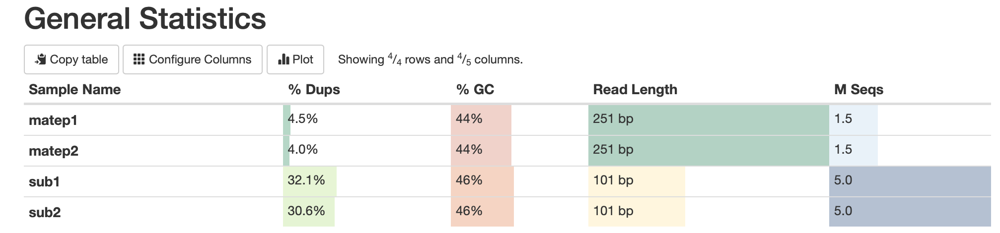
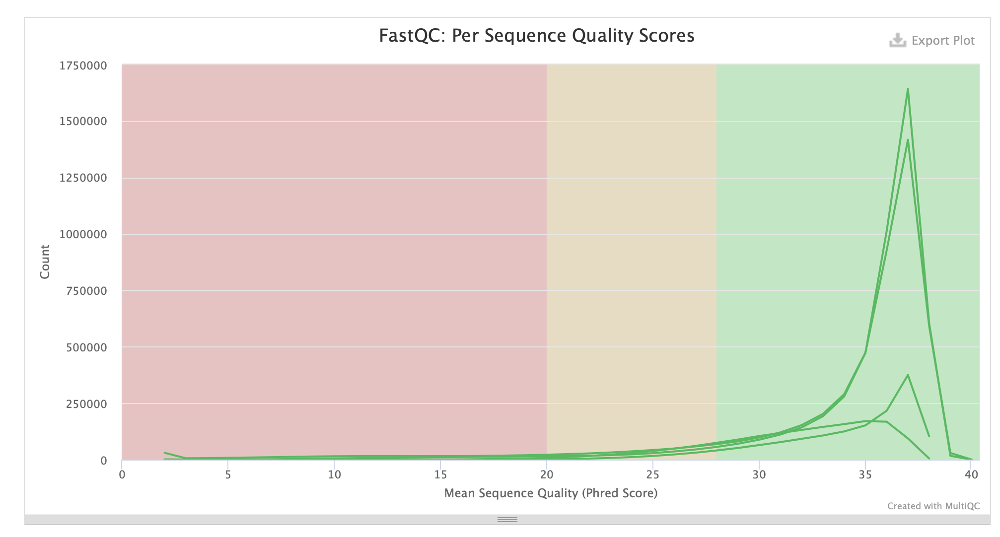
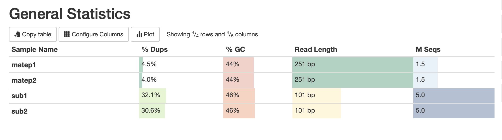
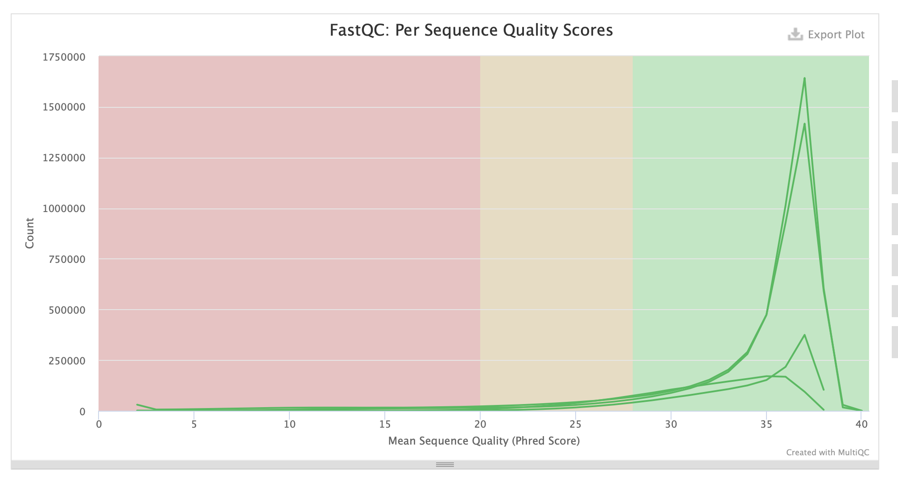

# hse22_hw1


### Создаем ссылки
```bash
ln -s /usr/share/data-minor-bioinf/assembly/*.fastq
```
### Ставим SEED=912 и выбираем соучайные чтения
```bash
seqtk sample -s$SEED oil_R1.fastq 5000000 > sub1.fastq
seqtk sample -s$SEED oil_R2.fastq 5000000 > sub2.fastq
seqtk sample -s$SEED oilMP_S4_L001_R1_001.fastq 1500000 > matep1.fastq
seqtk sample -s$SEED oilMP_S4_L001_R2_001.fastq 1500000 > matep2.fastq
```

### Оценка чтений с помощью FastQ
```bash
mkdir fastqc
ls sub* matep* | xargs -tI{} fastqc -o fastqc {}
```

### Создаем отчет с помощью MultiQ
```bash
mkdir multiqc
multiqc -o multiqc fastqc
```

### Отчет





### Обрезаем чтения
```bash
platanus_trim sub*
platanus_internal_trim matep*
```

#### Оценка обрезанных чтений с помощью FastQC
```bash
mkdir fastqc_trimmed
ls sub* matep*| xargs -tI{} fastqc -o fastqc_trimmed {}
```
#### Создание отчета с помощью MultiQC
```bash
mkdir multiqc_trimmed
multiqc -o multiqc_trimmed fastqc_trimmed
```
### Отчет 





#### Сбор контиг используя “platanus assemble”
```bash
platanus assemble -o Poil -f sub1.fastq.trimmed sub2.fastq.trimmed 2> assemble.log
```
#### Сбор скаффолдов используя
```bash
platanus scaffold -o Poil -c Poil_contig.fa -IP1 sub1.fastq.trimmed sub2.fastq.trimmed -OP2 matep1.fastq.int_trimmed matep2.fastq.int_trimmed 2> scaffold.log
```
#### Уменьшение числа промежутков
```bash
platanus gap_close -o Poil -c Poil_scaffold.fa -IP1 sub1.fastq.trimmed sub2.fastq.trimmed -OP2 matep1.fastq.int_trimmed matep2.fastq.int_trimmed 2> gapclose.log
```

#### Удаление подрезанных чтений
```bash
rm sub*.trimmed matep*.int_trimmed
```
### Бонус
```bash
seqtk sample -s912 oil_R1.fastq 500000 > bonus_sub_oilR1.fastq
seqtk sample -s912 oil_R2.fastq 500000 > bonus_sub_oilR2.fastq
seqtk sample -s912 oilMP_S4_L001_R1_001.fastq 150000 > bonus_sub_oilMP_R1.fastq
seqtk sample -s912 oilMP_S4_L001_R2_001.fastq 150000 > bonus_sub_oilMP_R2.fastq

platanus_trim bonus_sub_oilR*
platanus_internal_trim bonus_sub_oilMP*

platanus assemble -o Poil -f bonus_sub_oilR1.fastq.trimmed bonus_sub_oilR2.fastq.trimmed 2> bonus_assemble.log

platanus scaffold -o Poil -c Poil_contig.fa -IP1 bonus_sub_oilR1.fastq.trimmed bonus_sub_oilR2.fastq.trimmed -OP2 bonus_sub_oilMP_R1.fastq.int_trimmed bonus_sub_oilMP_R2.fastq.int_trimmed 2> bonus_scaffold.log

platanus gap_close -o Poil -c Poil_scaffold.fa -IP1 bonus_sub_oilR1.fastq.trimmed bonus_sub_oilR2.fastq.trimmed -OP2 bonus_sub_oilMP_R1.fastq.int_trimmed bonus_sub_oilMP_R2.fastq.int_trimmed 2> bonus_gapclose.log
```


